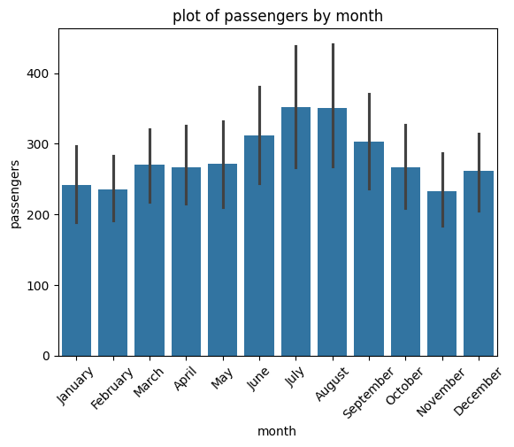

# ✈️ Flight Passenger Data Analysis

## 📌 About
A beginner data analysis project using a flight dataset 
as part of my AI Engineer learning journey (Stage 1).

## 📊 Dataset
- **Rows:** 144
- **Columns:** Year, Month, Passengers

## 🔍 What I Did
- Loaded and explored the dataset using Pandas
- Plotted a bar chart (Month vs Passengers) using Matplotlib/Seaborn

## 💡 Key Insight
July and August record the highest passenger traffic,
suggesting peak travel season falls in summer.

## 📈 Visualization

## 🛠️ Tools Used
- Python
- Pandas
- Matplotlib / Seaborn

## 🚀 Part of My Journey
This is Stage 1 of my AI Engineer roadmap.
Follow my journey: @Emmytoonz